# CSE15L Lab Report 1
Written by Kai Lee  

This report is a tutorial on how to set up a CSE ieng6 account on Visual Studio Code for UCSD students who will be taking CSE15L. In this tutorial, I will cover the following topics:

- Installing Visual Studio Code
- Connecting to your CSE ieng6 in VScode using ssh
- Basic remote operations
- Moving files with scp
- Setting an SSH key
- Optimizing remote connecting

Prerequisites for this tutorial: 
- Know your ieng6 login credentials.
- [Windows users only] Have OpenSSH installed.

## Installing Visual Studio Code
For this course, our primary environment is Visual Studio Code. Download the latest version of VScode [at their website](https://code.visualstudio.com/download). Select the version that matches your operating system, and follow the setup instructions of the installer.

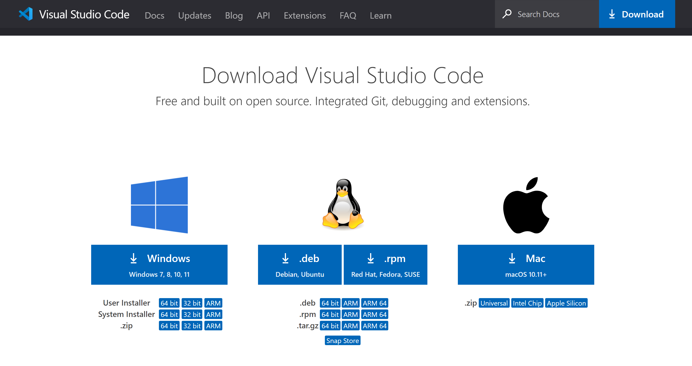

## Connecting Your CSE ieng6 Account in VScode
Open VScode. The interface may look slightly different depending on the version and operating system, but the functionality should remain the same. Open up a new terminal by navigating to Terminal > New Terminal.

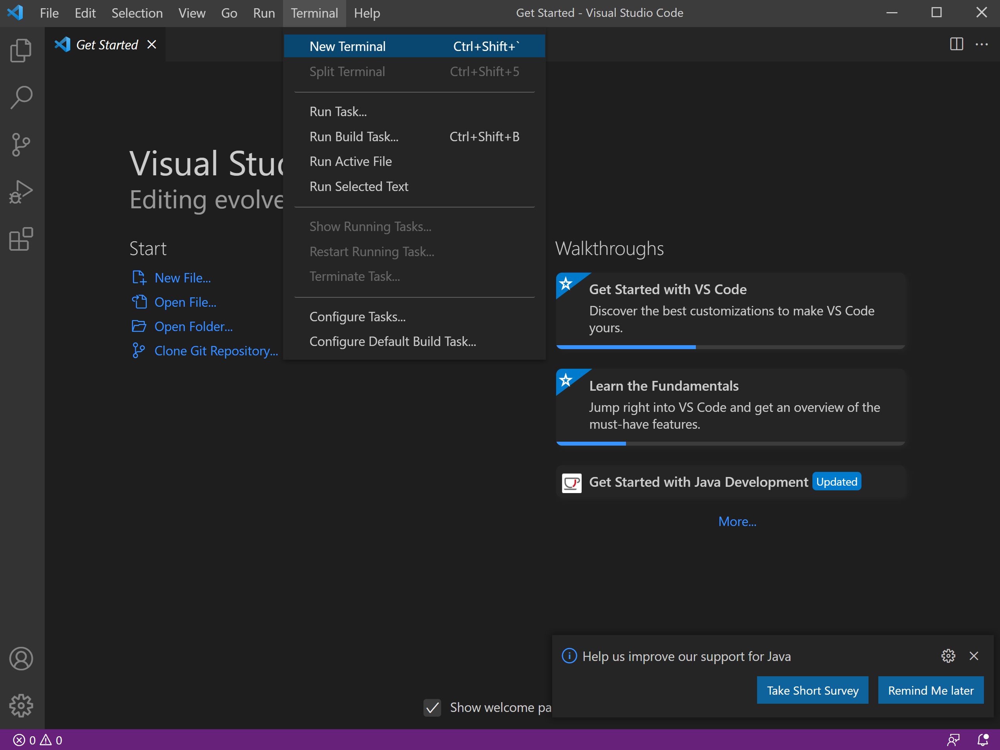

In the terminal, enter the following command, replacing your username in the placeholder:
>ssh yourusername@ieng6.ucsd.edu

When you run this command, you'll get a message telling you that the authenticity of the host can't be established. This is normal when you are connecting remotely to a server for the first time, and type in 'yes' when it asks you if you still want to proceed. Enter your password when prompted. The terminal should then output information on the server and cluster status.

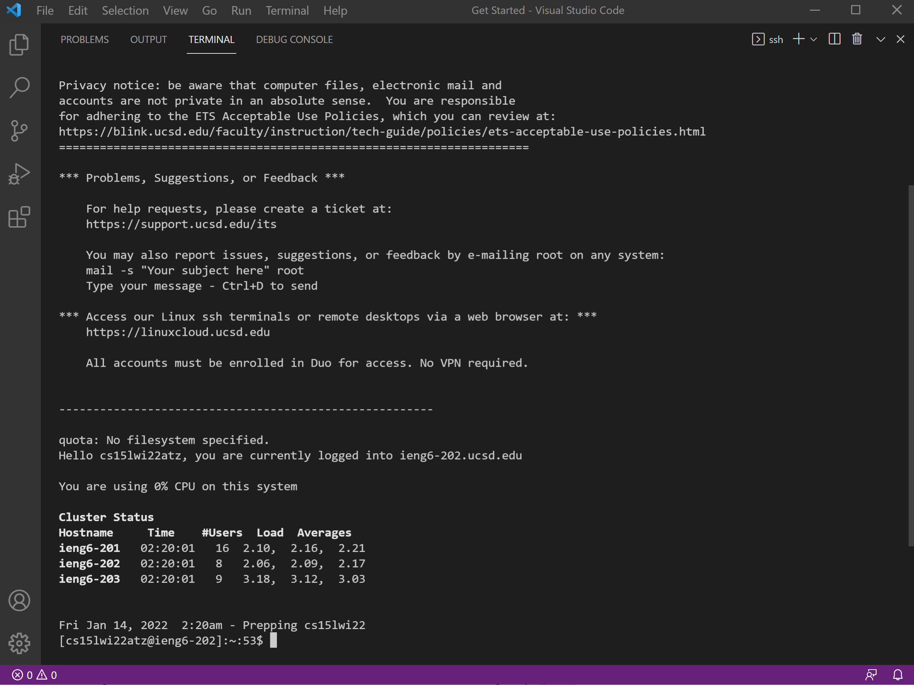

Notice that the text before your cursor in the terminal now displays [yourusername@ieng6-xyz]. This means that you are now connected remotely to the CSE server. Now, any commands that you run in the terminal won't run on your local machine, but rather on the machine that hosts the server that you are connected to. If you want to log out of the remote connection, press Ctrl+D, or enter the following command:
>exit

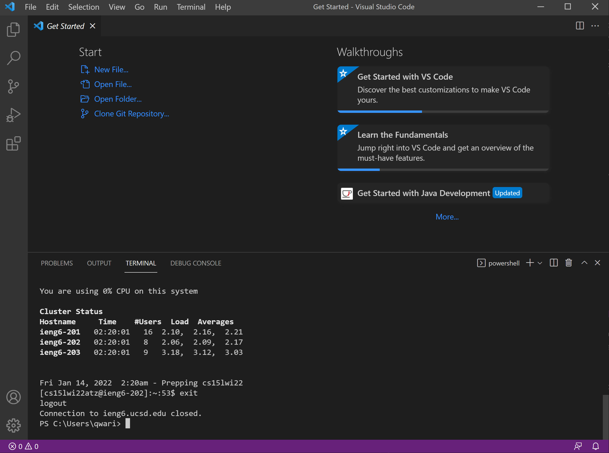
The terminal should then confirm that your connection to the remote server has been closed.

## Basic Remote Operations
Here are some basic terminal commands that you can run in order to navigate through your remote directory. 

>ls			    
pwd  
mkdir	   	   
cd	   

`ls` lists all of the files in your current directory. In this case, the files `WhereAmI.class` and `WhereAmI.class`, and the folders `perl5` and `week1` are in the home directory of the remote computer.

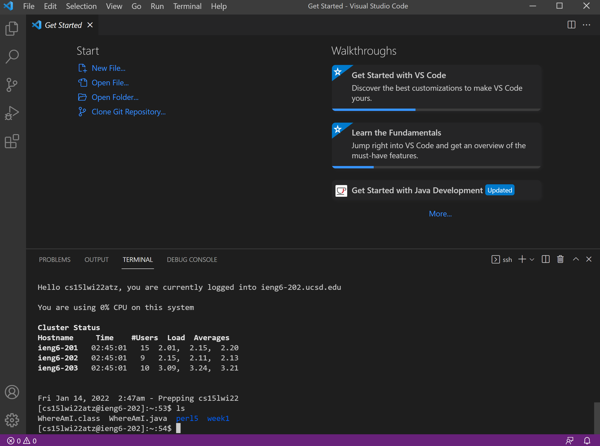

`pwd` prints the working directory. In this case, the working directory is `/home/linux/ieng6/cs15lwi22/cs15lwi22atz`. Notice that because a remote connection is established, this is the working directory of the remote computer, rather than the directory of the local machine.

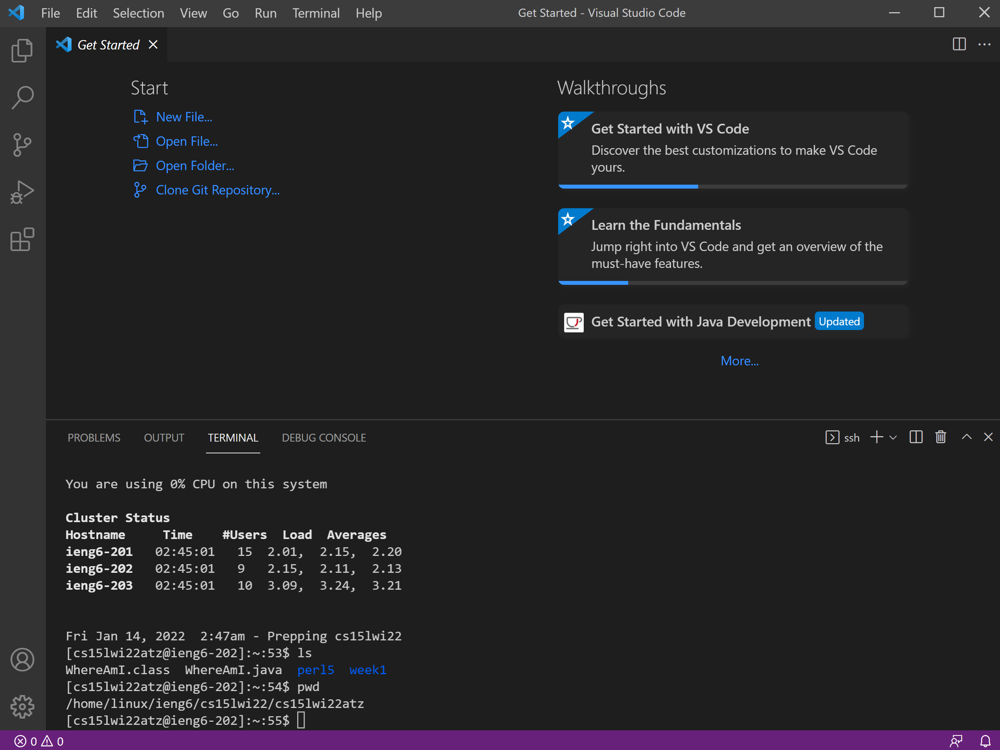

`mkdir` creates a folder in the current working directory. For example, calling `mkdir examplefolder` in the home directory creates a folder called `examplefolder` in the home directory. If we call `ls` again, `examplefolder` will be listed alongside the previously existing files.

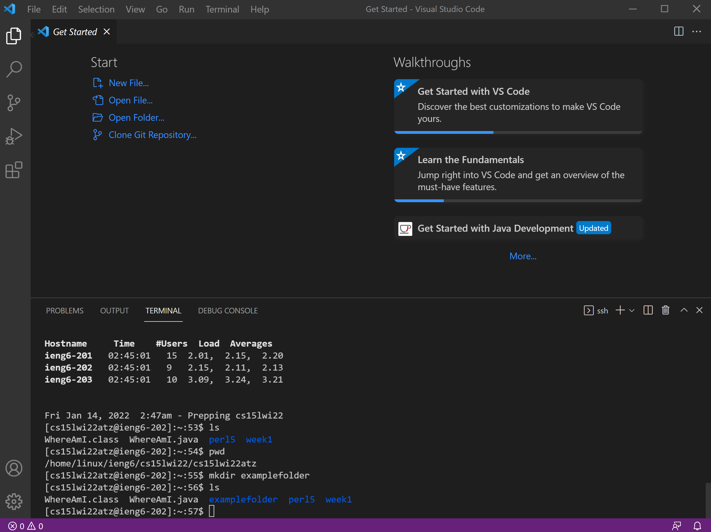

`cd` navigates to a specific directory by following a path from your current working directory. From the previous example, `cd examplefolder` while will navigate the working directory to `currentdirectory/examplefolder`, where `currentdirectory` is a placeholder for your working directory. `cd ..` will navigate to the parent directory of your current directory, and `cd ~` will navigate to your home directory.

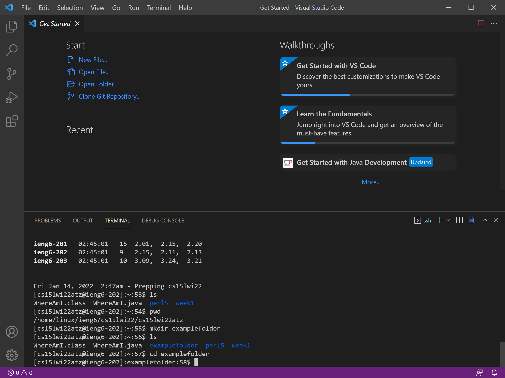

## Moving Files With SCP
You can use SCP command to copy files from your local machine to the remote machine. For example, in order to transfer the file HelloWorld.java from your local machine to the remote server, run the following command, and enter your password when prompted:
>scp HelloWorld.java yourusername@ieng6.ucsd.edu:~/

Notice that this command is being run on the local machine, not through a remote connection, and that HelloWorld.java is in the same directory as the current working directory of the terminal.

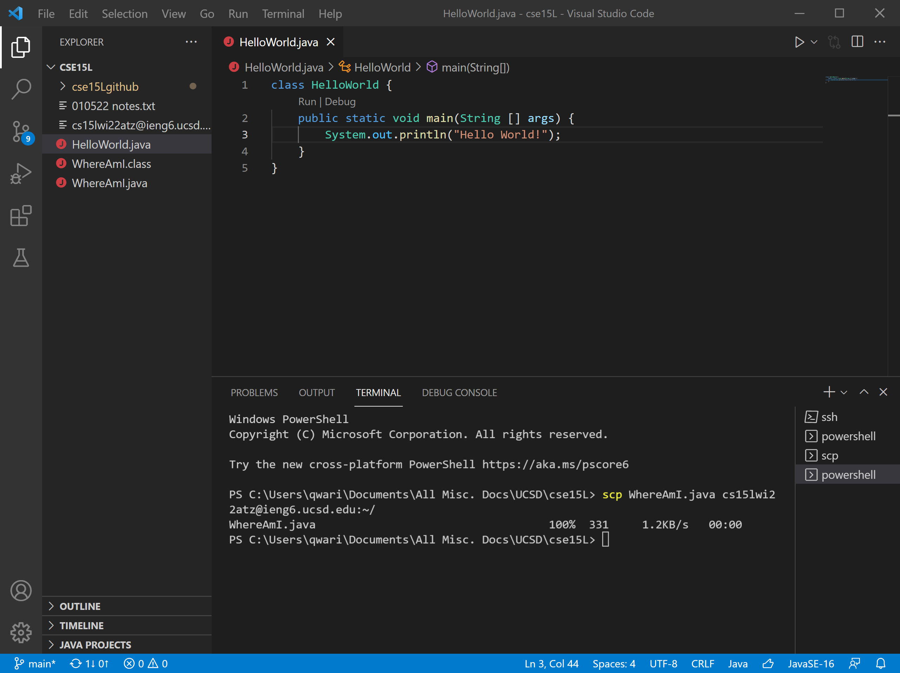

Logging back into the remote server and listing out the file contents following the file copy will then display `HelloWorld.java` as a file in the remote server.

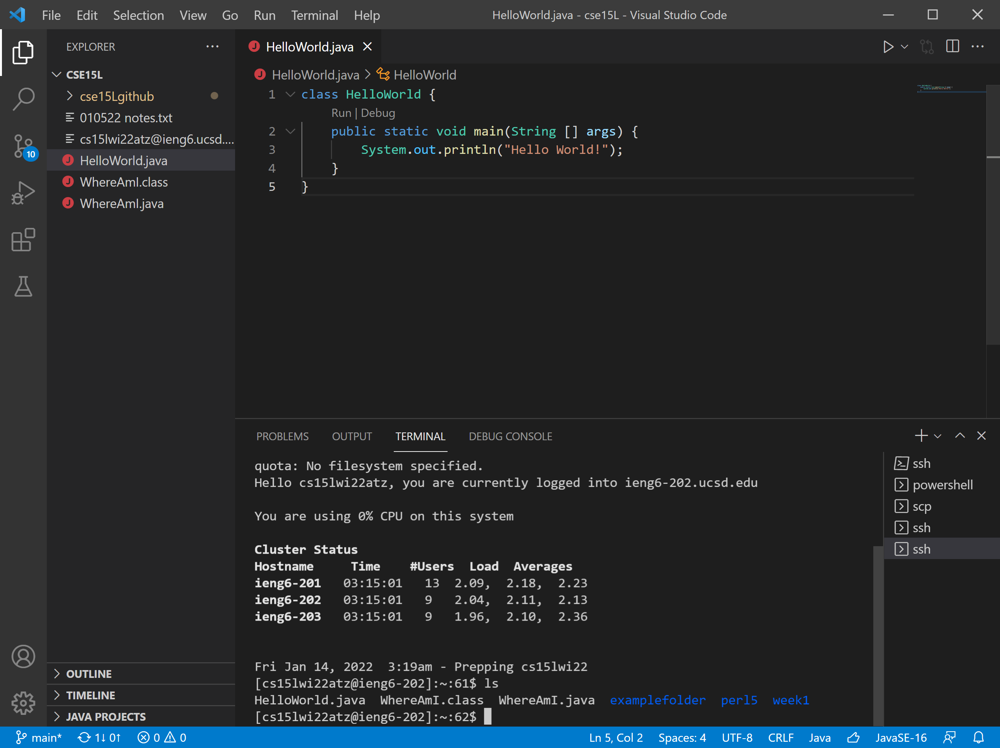

To run `HelloWorld.java` on the remote server, simply compile and run it normally while the remote connection is still established. Running `ls` again following this operation will show that `HelloWorld.class` was created during compilation, just as it would be if compiled locally.

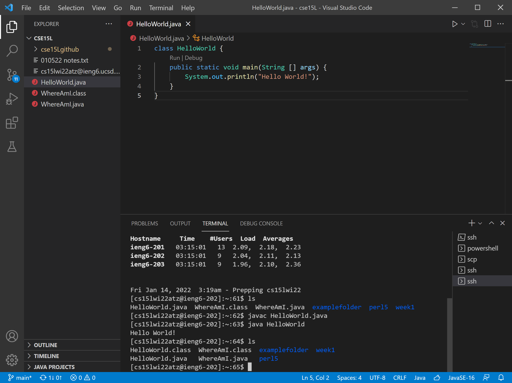

It's important to note that if you already have a file with the same name in your copy destination, scp will overwrite it with the new file that you are copying, so watch out for any duplicate filenames.

## Setting an SSH Key
There is a convenient way to bypass typing in a password every time you want to connect to or copy files to a remote server. By setting up an SSH key, which will be shared between your local machine and the remote server, you can eliminate the need to type your password every time you establish a remote connection.  
On your local machine, run the following command:
>ssh-keygen

Store your key in `/Users/youruser/.ssh/id_rsa`, where `youruser` is a placeholder for the username of your local machine. Then, login to your remote connection and create a .ssh directory using the following command:
>mkdir.ssh

Log out of your remote connection, and copy the key from your local machine to the remote server using the following command:  
>scp /Users/youruser/.ssh/id_rsa.pub yourusername@ieng6.ucsd.edu:~/.ssh/authorized_keys

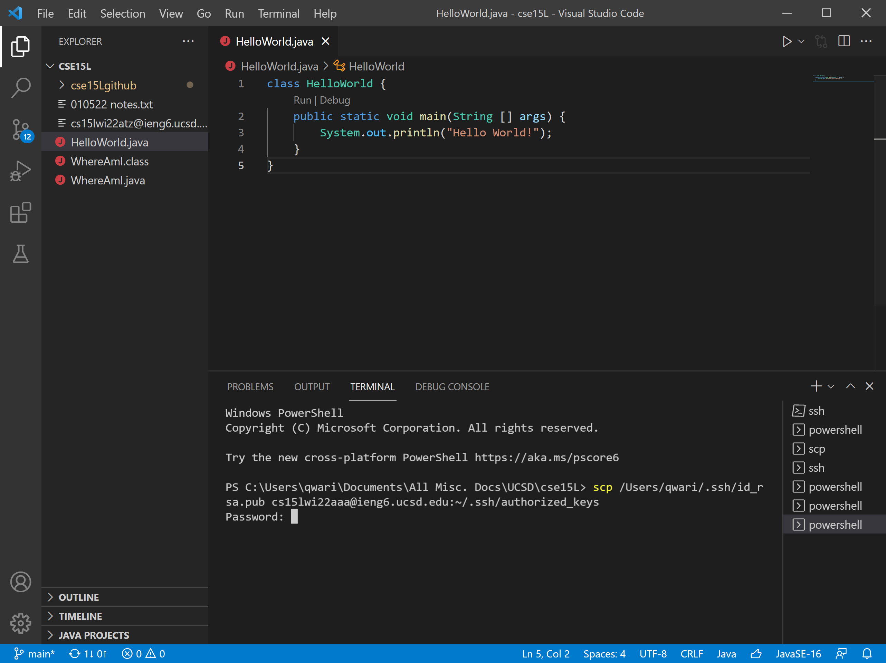

Now, try to login to your remote connection again. If you aren't prompted for a password, you've successfully set up your key.

## Optimizing Remote Connecting
There is an alternative way to run commands on a remote server without having to login first. With an SSH key pairing established between your local machine and remote server, it is possible to run a command from your local machine through the following command:
>ssh yourusername@ieng6.ucsd.edu "your command in quotes"

In order to run multiple operations in one single line, seperate each command with a semicolon:
>ssh yourusername@ieng6.ucsd.edu "command 1; command 2; command 3"

For example, the following command will compile and run HelloWorld.java on the remote server from the local machine in one line.

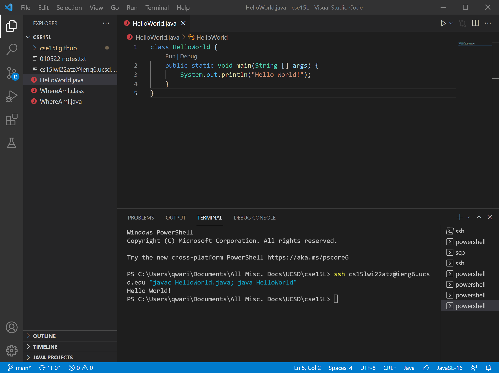
