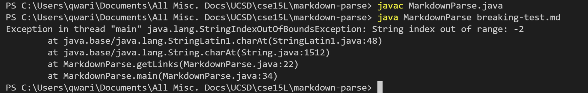

# CSE15L Lab Report 2
Written by Kai Lee  

## Error 1
One error in the program is that it would incorrectly interpret an image tag as a link. As the syntax for both a link and an image is denoted by brackets and parentheses, the program indiscriminately reads the contents for links and images. This is fixed by checking if there is an "!" before the opening bracket, if the bracket does not occupy the first index in the file, which is an indicator that the following code is actually the syntax for an image. 

[Error output:](https://github.com/tedd-E/markdown-parse/commit/a5f3d88b44808c1d13a315a80c297bf0d2eb60f6)

[Applied fix:](https://github.com/tedd-E/markdown-parse/commit/8c1e179cfdb9bcbaf832d6c597ed9b887e1f2c7e)

## Error 2
The second error in the program is that it does not handle misformatted links correctly. If a link is provided without being enclosed in parentheses, the program will assign an invalid location to the indices of the open and close parentheses, which will result in an index out-of-bounds error when the program tries to read the substring between the two invalid indices. This is fixed by adding a conditional statement to ensure that there is a valid parenthese following the closing bracket; if not, the program will skip straight to the next link.

[Error output:](https://github.com/tedd-E/markdown-parse/blob/main/no-paren.md)

[Applied fix:](https://github.com/tedd-E/markdown-parse/commit/9bff1d609429beda57525b5937a9f208175b6a99)

## Error 3
The third error involves trailing newlines at the end of the markdown file. Because the program terminates when it detects that the variable currentIndex is greater than or equal to the length of the file, it will run for one extra while loop and attempt to access invalid indices in the file in the event that there is a trailing newline behind the links, as the value of currentIndex is updated to be the next index immediately following the last closing parentheses. This is fixed by stripping the contents of the file of its whitespace to remove any possible newlines, so that the while loop will terminate correctly.

[Error output:](https://github.com/tedd-E/markdown-parse/blob/main/breaking-test.md)

[Applied Fix:](https://github.com/tedd-E/markdown-parse/commit/6ece59984b906e9187c1ec09b7d9cb1dc95f037f)
