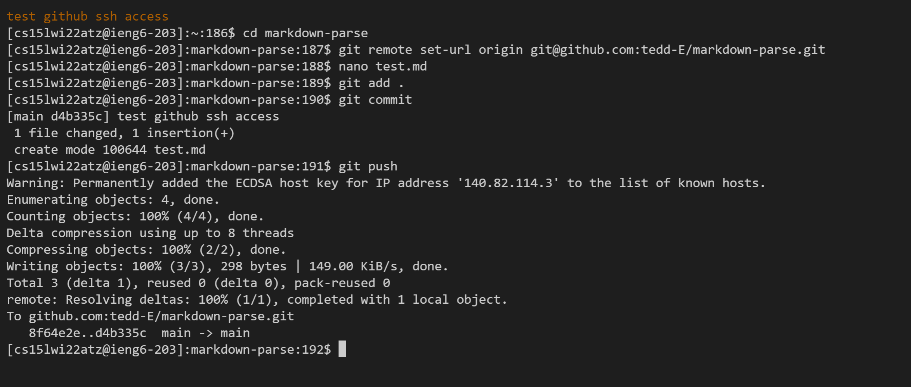

# CSE15L Lab Report 3
Written by Kai Lee

This report will cover how to setup github access from an ieng6 remote server.

## Prerequisites: 
- Access to your github account
- Access to ieng6 login credentials ([see here for ieng6 setup details](https://tedd-e.github.io/cse15l-lab-reports/lab-report-1-week-2.html))

## 1. Generate ssh key
Login to your remote ieng6 account ([see here for ieng6 login details](https://tedd-e.github.io/cse15l-lab-reports/lab-report-1-week-2.html)), and generate an ssh key by entering the following, making sure to put your own ieng6 email in the placeholder:

```ssh-keygen```

Then, save the key in your directory of choice (or just press enter to save to the default .ssh folder).


## 2. Copy public key
Navigate to the directory where you saved the key in the previous step, and enter the following command to obtain your public key: 

```cat id_rsa.pub```

Then, copy the resulting output to your clipboard. Make sure not to copy any whitespace before or after the public key.


## 3. Register ssh key to github
In your github account, navigate to Settings > SSH and GPG keys. Select "Create a new SSH key" and paste in the key you just copied into the text box, and give the key an identifier you'll remember.


Test your key by entering the following command on your ieng6 virtual machine:

```ssh -T git@github.com```

You should get a message similar to the following:


## 4. Set directory to a local clone of your github repository
Navigate to the file you want to setup your github repository in, and enter the following command, replacing "username/your-repository.git" with your own username and repository path:

```git remote set-url origin git@github.com:username/your-repository.git```


You can now make changes to your repository without having to enter a username and ssh key every time you want to make any changes. In the example below, I create a markdown file called "test.md" and push it to my repository in markdown-parse. As expected, I don't have to enter a username or ssh key in order to push the changes.


Here is the [link](https://github.com/tedd-E/markdown-parse/commit/d4b335c738ed98dcf43b03481fdb22c8e6b799b4) to the resulting commit. 