# CSE15L Lab Report 4
Written by Kai Lee

This report will test the implementation of two different versions of the markdown-parse project on the same test files. The source code that is used to run each implementation are provided below.

First markdown-parse project (my implementation): [link](https://github.com/tedd-E/markdown-parse)

Second markdown-parse project (other implementation): [link](https://github.com/johnsonli010801/markdown-parse)

According to [the Commonmark demo site](https://spec.commonmark.org/dingus/), the output of the snippets in markdown-parse should look as follows:
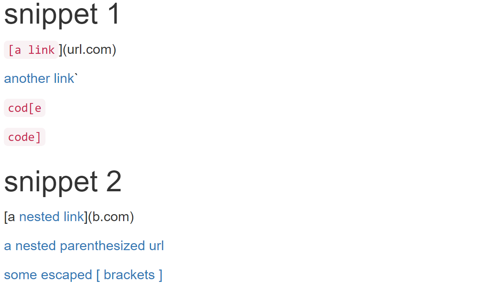
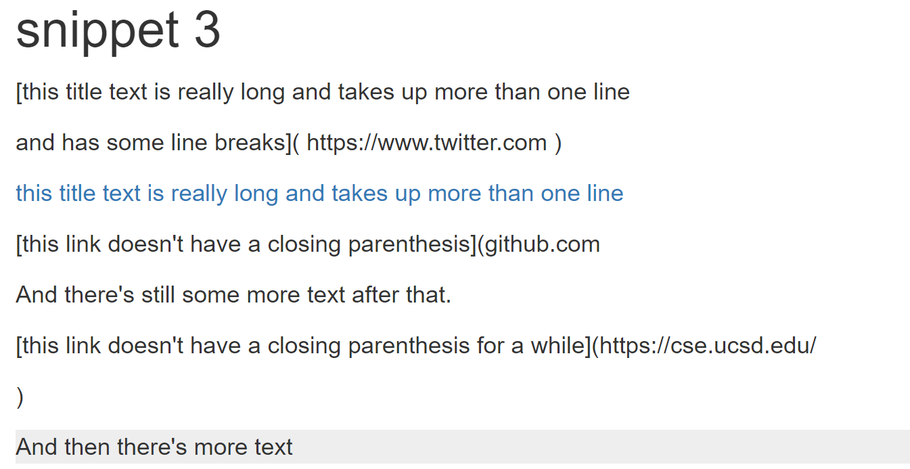
Therefore, I will be implementing the expected output of the test cases according to the results shown above.

## Implementation 1
The implementation of the test is as shown:
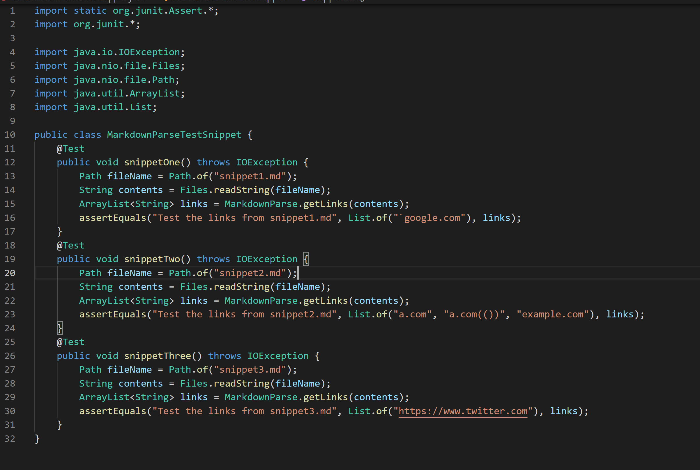

The original MarkdownParse.java file is as shown:
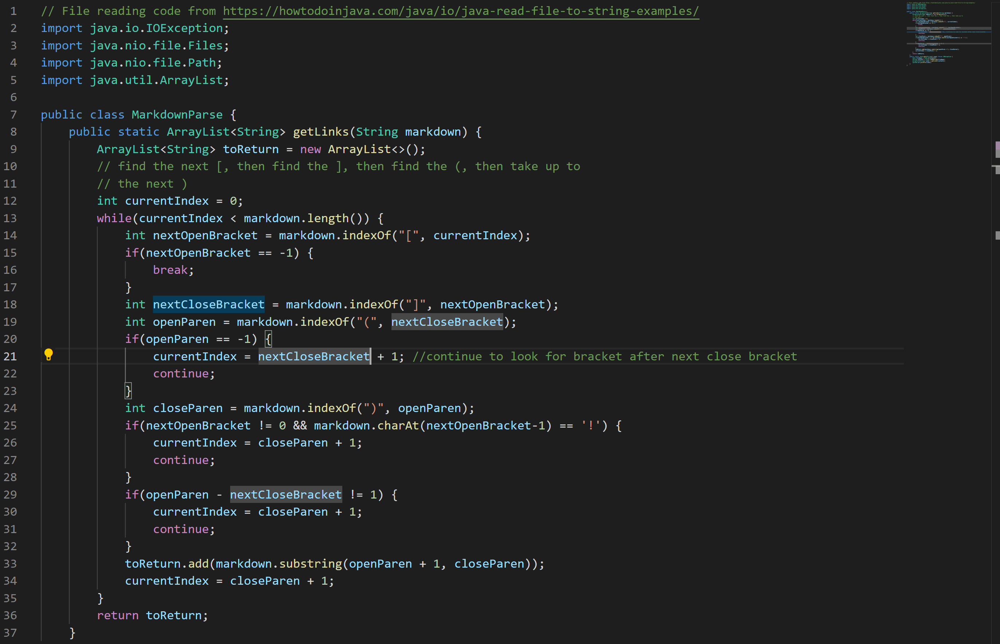

Below are the results of testing the [3 provided code snippets](https://ucsd-cse15l-w22.github.io/week/week8/) on my version of markdown-parse. 
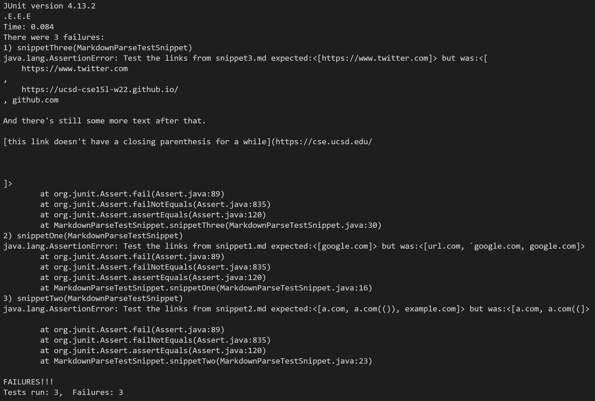
All three tests failed to produce the expected output.

1. Snippet one
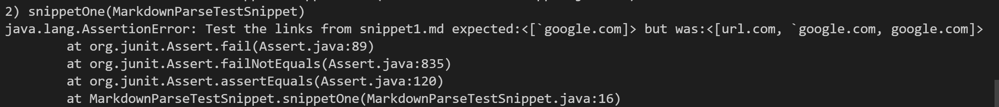
This test failed as the program only looked for the first opening parenthese following the last closing bracket it detects, without checking to see if the closing bracket was preceded by a valid opening bracket. It is possible to fix this bug in less than 10 lines by adding an additional condition to the if statement that checks that there is an opening bracket between the last closing parentheses of the previous link (if there is one) and the current closing bracket.

2. Snippet two
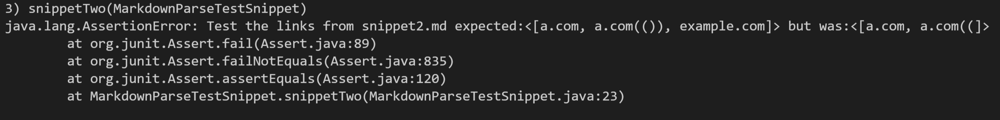
This test failed as the program assumes that the links do not contain parentheses, and so reads in a link as soon as it detects the first closing parentheses following the current opening parentheses. This can be fixed in under 10 lines of code by having the program scan for the last parentheses in the entire line. This could be done by checking the string starting from the last character in the current line, so the first closing parentheses detected through this direction of traversal would be the last when read in order.

3. Snippet three
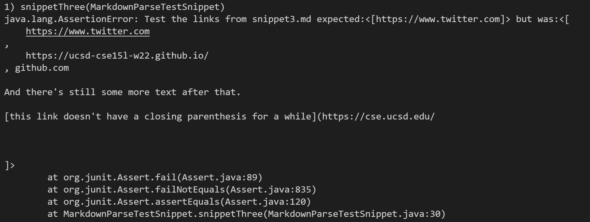
This test failed because the program accepted links that contained newlines. This can be fixed in under 10 lines of code by splitting the string into an array by using whitespaces and newlines as seperators, and saving only the first element in the array as the link contents (thus eliminating all the rest of the contents following the first whitespace detected).

## Implementation 2
The implementation of the test is as shown:
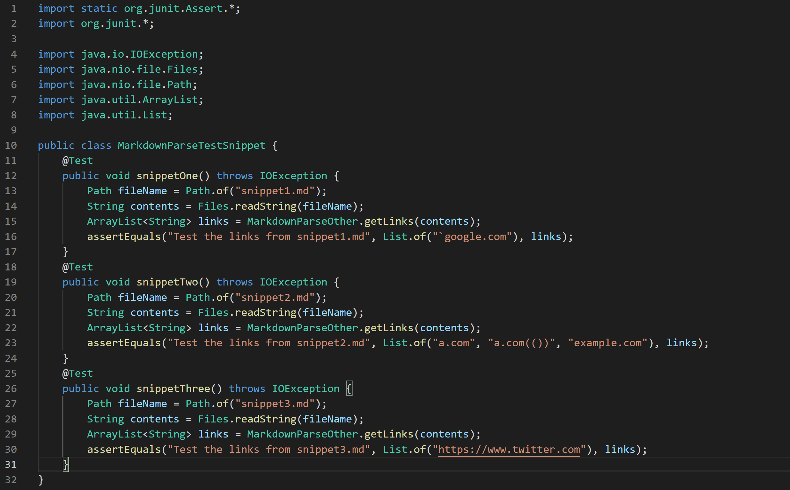

The original markdownparse file is as shown:
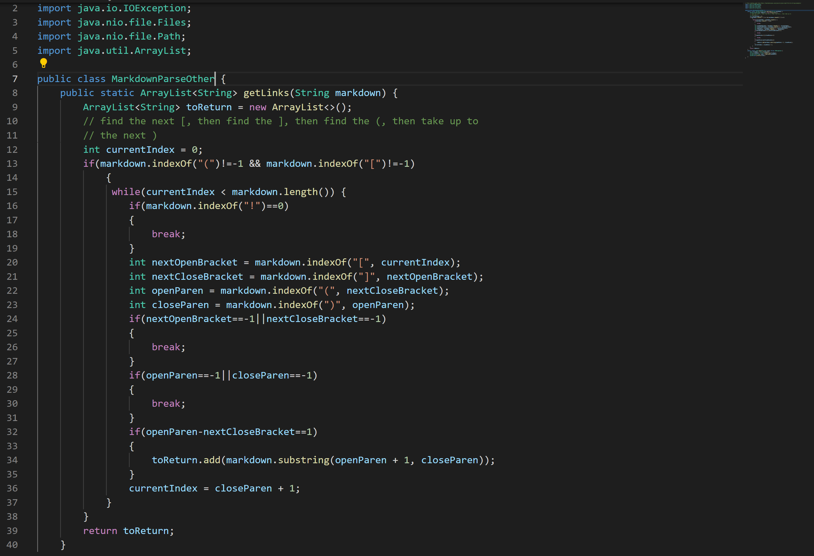

Below are the results of testing the [3 provided code snippets](https://ucsd-cse15l-w22.github.io/week/week8/) on the other version of markdown-parse.
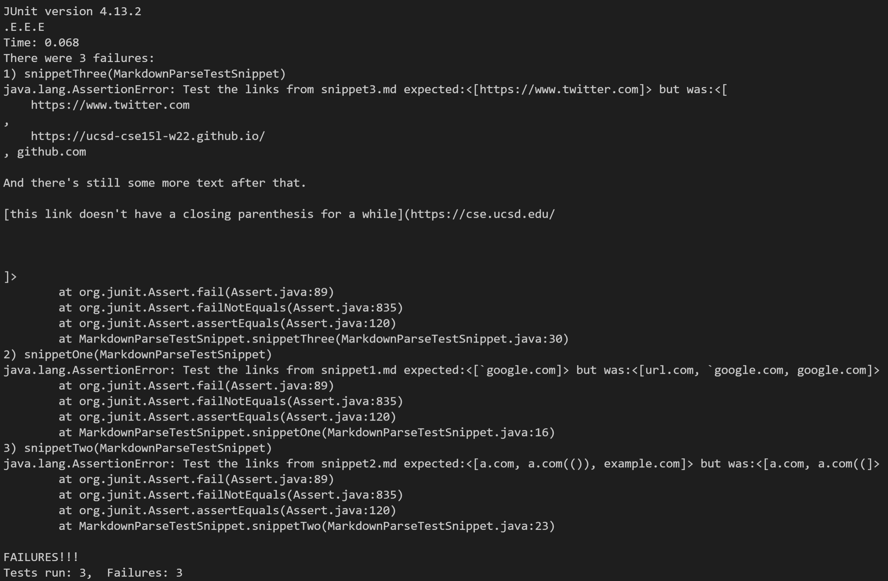
All three tests failed to produce the expected output.