# CSE15L Lab Report 5
Written by Kai Lee

This report will examine differing tests from two different implementations of markdown-parse, the [provided version](https://github.com/ucsd-cse15l-w22/markdown-parse) and [my version](https://github.com/tedd-E/markdown-parse), and identify their bugs.

For the rest of this report, the code that I will reference when discussing bugs in the code can be found in the github repositories that are hyperlinked above. The file that I will focus on will be ```MarkdownParse.java``` for both implementations.


First, we find two files to serve as our test cases. We can do so by running each version of markdown-parse, and storing and comparing the results by writing the output to text files and calling the ```diff``` command.

Here, the output of the provided implementation is stored in ```providedresults.txt```, and the output of my implementation is stored in ```myresults.txt```.
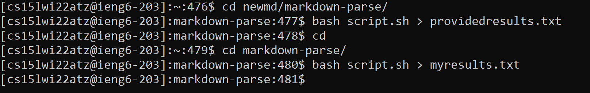

Running the ```diff``` command gives the resulting output. Since there are a lot of differences, I'm going to randomly select the first two differences, on line 212 and line 230 to analyze closer.
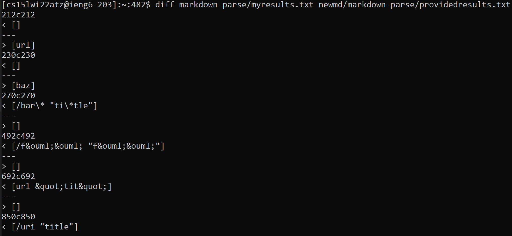

## Test 194
The first file I'll analyze across the two implementations is ```194.md```. 

My implementation output:
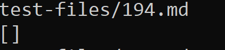

Provided implementation output:
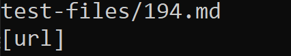

We take a look at the original contents of ```194.md``` to see the following:
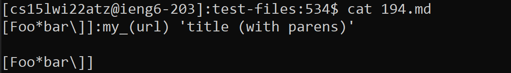

Running the original contents on the [Commonmark Demo site](https://spec.commonmark.org/dingus/) shows the following output:
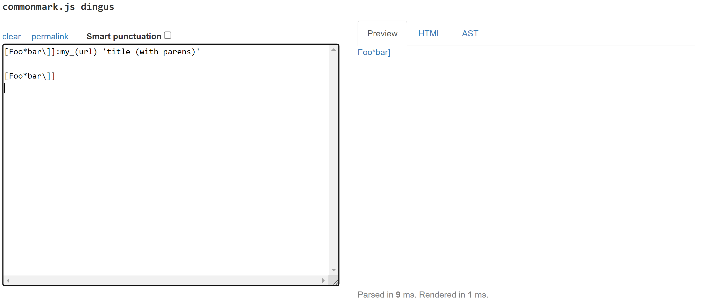

It can be seen that the output of the official demo site doesn't match the output of either implementation we ran. Instead of a blank output or reading "url" in the parentheses as the link, the official demo is parsing "Foo*bar\\]" in the first line as the hyperlink text, and "my_(url)" as the link address, ignoring the third line entirely.

The code in my implementation requires every file it reads to have a corresponding opening and closing bracket, as well as an opening and closing parentheses immediately afterward, so the code will automatically stop running when it detects that the contents of the file don't match up to the exact format of "(open bracket)(hyperlink text)(closing bracket)(open parentheses)(link)(closing parentheses)", while the commonmark demo is more lenient with the formatting. In order to fix the bug so the code will parse the file correctly, I'd change the conditional statement that checks all four indices of the opening and closing brackets and parentheses at once, and instead parse the contents between the brackets first, then check for parentheses anywhere in the rest of the file following the closing bracket in order to parse the link address.
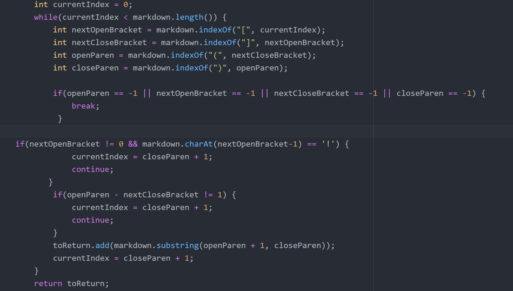 

The code in the implementation searches for the first set of parentheses after the most recently closing bracket, and parses the contents in between the parentheses as the link. Although this could arguably be interpreted as a correct way to parse the link, it does not match the output of the official demo, and so this behavior will be treated as a bug. Since the official Commonmark demo is more lenient with the formatting, it treats the text following the closing bracket as the link until the next whitespace. Therefore, in order to fix the provided implementation, I'd change the code to read the contents following the closing bracket until the program encounters a whitespace if it does not encounter the expected standard format of an open parentheses immediately following the closing bracket, at which point the program will store the contents as the link address.
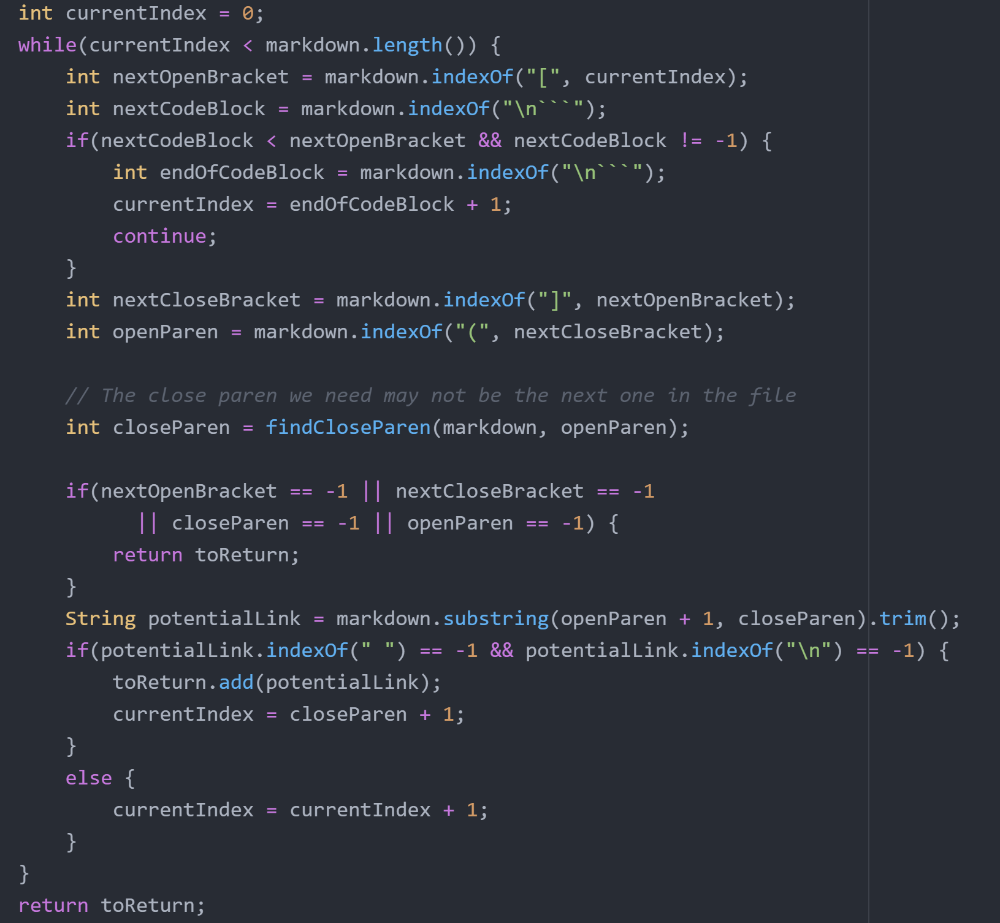

## Test 201
The next file I'll analyze is ```201.md```. 

My implementation output:
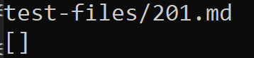

Provided implementation output:
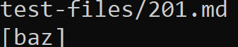

We take a look at the original contents of ```201.md``` to see the following:
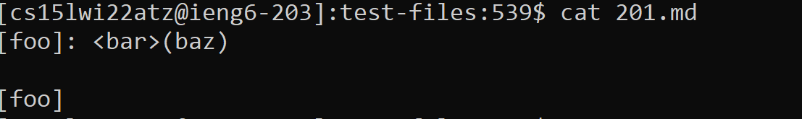

Running the original contents on the [Commonmark Demo site](https://spec.commonmark.org/dingus/) shows the following output:
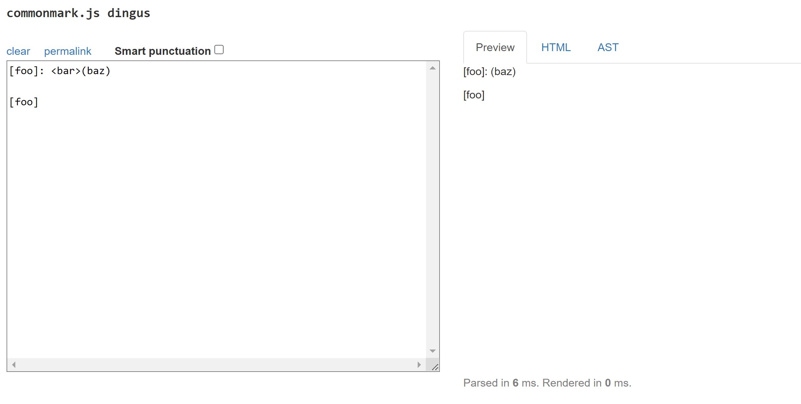

It can be seen that the output of the official demo site matches the output of my implementation, but not the provided implementation. Instead of a blank output or reading "baz" in the parentheses as the link, the official demo does not recognize any link in the file. Although the output of my implementation happens to match the output of the official Commonmark, this is just a coincidence of the file formatting, rather than intentional code design. 

For both my implementation and the provided implementation, I would fix the same thing. Neither my code nor the provided code takes into account the possibility that there could be other arguments besides just parsing links that might need to be processed by the program, such as carat commands like the "\<bar>" that is in the contents of the original file. There are no specific parts in either program that contain the issue, since the bug in this case isn't due to a logic error, but rather due to the program failing to address the possibility of having to parse a different class of arguments outside of links. In order to fix the both implementations, I'd add on to the code to find the index of the last closing bracket for an argument, then check for other characters that denote other arguments, such as the carat symbol. If additional types of arguments are detected, the priority for the following text will be given to the additional arguments instead of the argument to parse the links. 

For my implementation, I would add the additional code after the conditional statement checking for invalid brackets and parentheses and before the statement that adds the assumed link to the array of links to return.


For the provided implementation, I would add the additional code after the conditional statement checking for the closing brackets and before the line where the string potentialLink is initialized.
